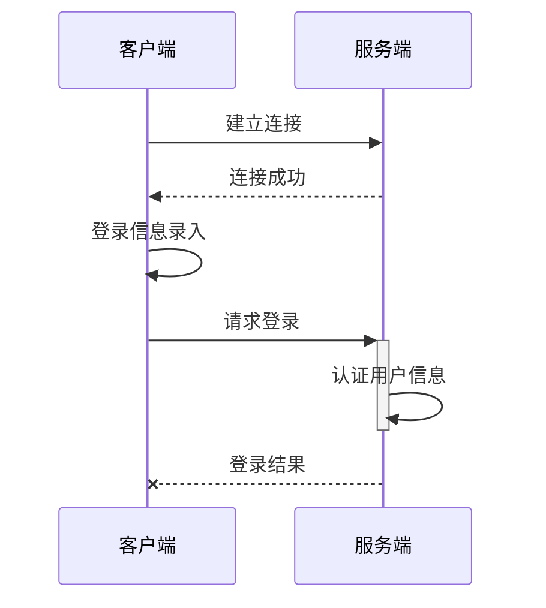
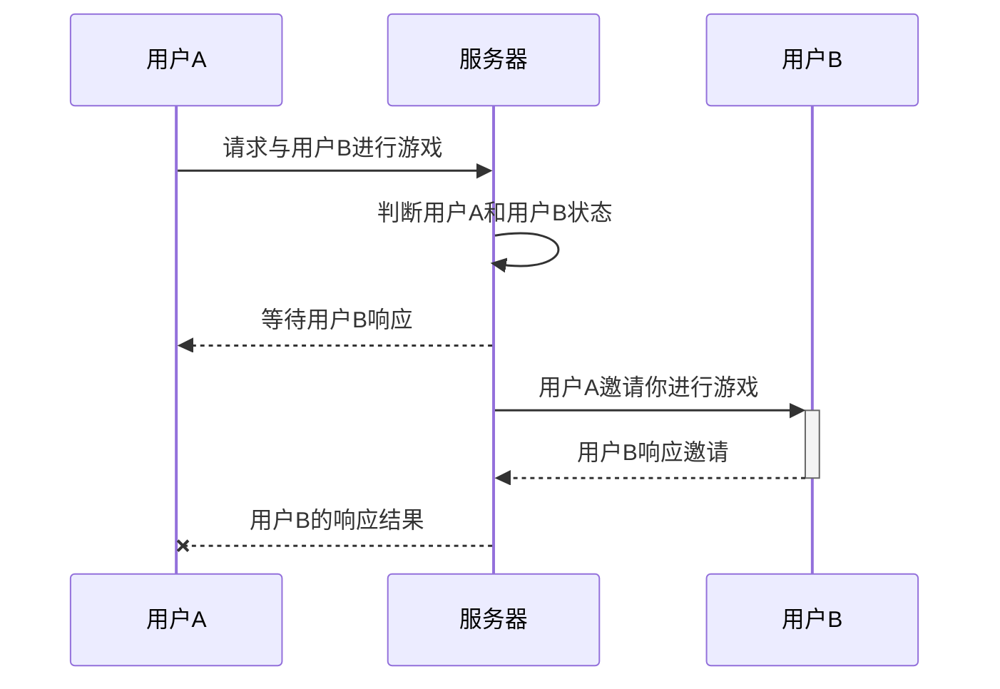

# fivechess

## 介绍
使用JavaFx实现的五子棋游戏

## 软件架构
1. 前端数据存储：sqlite
2. 前端展示：JavaFx
3. 前后端网络请求：smart-socket

## 安装教程
安装JDK 8+运行环境即可

## 截图

## 流程说明
### 1、登录流程

### 2、游戏邀请

## 参与贡献
1.  Fork 本仓库
2.  新建 Feat_xxx 分支
3.  提交代码
4.  新建 Pull Request
